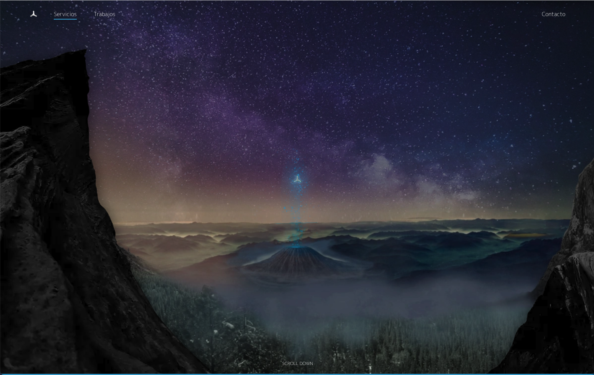

# Digital Media 211 - Dm211 (2016-2023)


My home page since 2016 to 2023<br/>
Website originally created in PHP + Api version.<br/>
Later modified for Vue2 + WebPack without any API



## Setup

Download [Node.js](https://nodejs.org/en/download/).
Run this followed commands:

``` bash
# Install dependencies (only for first time)
npm i

# Serve at localhost
npm run serve

# Build for production in the dist/ directory
npm run build-prod
```

